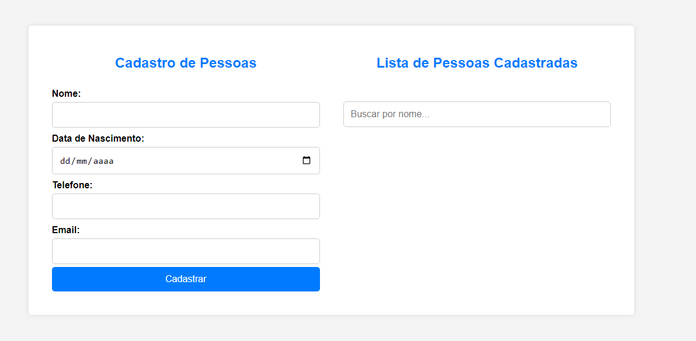

## Sistema em JavaScript para Armazenamento de Dados Cadastrais

Um sistema eficiente e intuitivo para gerenciar uma lista de pessoas através de uma interface web, desenvolvido em JavaScript.

## Visão Geral

Este projeto implementa um sistema para armazenamento de dados cadastrais que permite criar, visualizar, editar e excluir registros de indivíduos. Utiliza o padrão Factory para a criação de objetos pessoa e armazenamento local (localStorage) para garantir a persistência dos dados entre sessões. A interface é projetada para oferecer uma experiência amigável e responsiva ao usuário, com recursos avançados de filtragem por nome e interatividade em tempo real.

## Funcionalidades

- Criação de Pessoa: Adiciona novos registros de pessoa com detalhes como nome, data de nascimento, telefone e email.
- Edição de Pessoa: Modifica facilmente os dados de uma pessoa existente na lista.
- Exclusão de Pessoa: Remove registros de pessoas que não são mais necessários.
- Filtragem por Nome: Encontra pessoas específicas na lista através de uma busca por nome em tempo real.
- Armazenamento Local: Utiliza localStorage para manter os dados localmente, garantindo acesso rápido e confiável.
- Interface Responsiva: Conta com uma interface intuitiva que se adapta a diferentes dispositivos e tamanhos de tela.

## Como Usar

1. Instalação:
   - Clone o repositório:
     
     git clone https://github.com/gabrielleg0mes/lista-cadastro
     
   - Abra o arquivo index.html no seu navegador.

2. Uso:
   - Preencha o formulário para adicionar uma nova pessoa.
   - Clique em "Editar" ao lado de uma pessoa para modificar seus dados.
   - Clique em "Excluir" para remover uma pessoa da lista.
   - Use o campo de busca para encontrar pessoas por nome.

## Dificuldades Enfrentadas

Durante o desenvolvimento, enfrentei desafios significativos que impactaram o processo:

- Git: Inicialmente, não tinha experiência prévia com Git, o que dificultou a compreensão de conceitos como commits e merges. Através do curso da trilha e alguns materiais, consegui superar esse obstáculo.

- JavaScript: Apesar de ter alguma familiaridade com JavaScript, encontrei dificuldades ao lidar com comandos menos familiares. Com o curso da trilha e prática, consegui melhorar significativamente meu domínio da linguagem.

## Contato

- Email: gabriellesouza1711@gmail.com
- GitHub: github.com/gabrielleg0mes
